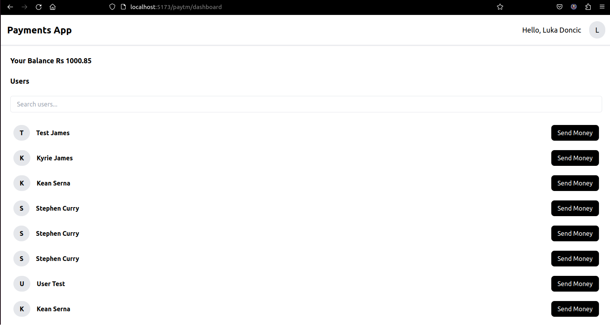

# PayTm clone 



## Getting Started

Follow the steps below to set up and run both the backend and frontend locally.

### How to Run the App Locally

1. **Clone the repository onto your machine:**
   ```
     git clone <repository-url>
     cd Backend/
       npm install
       npm run dev

     cd Frontend/
       npm install
       npm run dev
   ```
